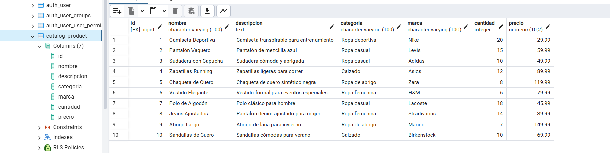

# M07_UF3_ACT15

## Productes a la base de dades:

## Enlace video probes endpoints:
https://drive.google.com/file/d/1eDm4vDO6x5MFd4ZGU8D8mOCByoaWnkYf/view?usp=sharing

1. Productos (Catalog):
GET    /catalog/products/
POST   /catalog/products/create/
GET    /catalog/products/2/
PUT    /catalog/products/2/update/
DELETE /catalog/products/2/delete/

2. Carrito:
GET    /api/cart/add/1/2/ 

3. Comandas (Orders):
GET    /api/comandes/        # Ver todas las comandas
GET    /api/comandes/1/      # Ver detalle de comanda 1
POST   /api/comandes/        # Crear comanda nueva
PUT    /api/comandes/1/      # Actualizar comanda
DELETE /api/comandes/1/      # Eliminar comanda

POST   /api/productes-comanda/   # Añadir producto a comanda
GET    /api/productes-comanda/   # Ver todos los productos en comandas

4. Pagos (Payment):
GET    /payment/payments/                          # Ver todos los pagos
GET    /payment/users/ids/                        # Obtener IDs de usuarios
PUT    /payment/orders/<order_id>/update_status/  # Actualizar estado de una comanda